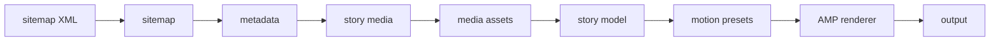

# Arquitetura

## Desenho

O projeto usa uma única vertical slice: `src/generate-web-stories`.

## Módulos

- `sitemap.ts`: transforma XML em entradas de post.
- `metadata.ts`: resolve título, descrição, publisher, imagem e vídeo por REST/HTML.
- `story.ts`: aplica regras de variante, texto curto, fallback de vídeo e composição das páginas.
- `motion.ts`: centraliza intenções narrativas, timings e atributos AMP de animação.
- `media.ts`: rasteriza poster e logo.
- `amp.ts`: renderiza AMP HTML.
- `output.ts`: escreve índice, sitemap, `robots.txt` e relatórios.
- `generate-web-stories.ts`: orquestra o lote com concorrência controlada.
- `cli-options.ts`: normaliza flags da CLI.

## Fronteiras

- Rede entra por `fetchText`, `fetchJson` e `fetchBinary`.
- Filesystem fica em `media.ts`, `output.ts` e na escrita final da story.
- Renderização não busca rede.
- Renderização aplica atributos AMP já decididos por `motion.ts`; não decide coreografia.
- Resolução de metadados não escreve arquivos.
- Orquestração não conhece detalhes de HTML além de chamar o renderer.

## Padrões De Engenharia

- KISS: só existem módulos com responsabilidade usada no fluxo atual.
- YAGNI: publicação no WordPress, cache incremental e painel ficam fora do código.
- SOLID pragmático: responsabilidades são separadas por comportamento real, não por camadas abstratas.
- Vertical slice: regras, IO e testes do fluxo ficam próximos.
- Testabilidade: dependências externas são injetáveis apenas nas fronteiras que precisam de teste confiável.
- Motion editorial: animações são AMP-native, tipadas por intenção de página e limitadas a entrada de mídia/texto.
