# Arquitetura

## Desenho

O projeto usa uma única vertical slice: `src/generate-web-stories`.

A slice concentra o produto inteiro do desafio: ler sitemap WordPress, resolver metadados, preparar assets, compor Web Stories, renderizar AMP e escrever artefatos estáticos. Entry points externos ficam finos e apenas acionam a slice.

```mermaid
flowchart LR
  A["sitemap XML"] --> B["sitemap"]
  B --> C["URL filter"]
  C --> D["metadata"]
  D --> E["story media"]
  E --> F["media assets"]
  F --> G["story generator"]
  G --> H["story model"]
  H --> I["motion presets"]
  I --> J["AMP renderer"]
  J --> K["output"]
  K --> L["index gallery + sitemap XSL"]
```

## Módulos

- `sitemap.ts`: transforma XML em entradas de post.
- `source-filter.ts`: aplica filtro opcional de URL após o sitemap e antes do limite.
- `metadata.ts`: resolve título, descrição, publisher, imagens e vídeo por REST/HTML.
- `metadata-html.ts`: extrai metadados HTML e múltiplas imagens quando a origem já é uma Web Story AMP.
- `story.ts`: aplica regras de variante, texto curto, fallback de vídeo e composição das 6 páginas.
- `motion.ts`: centraliza intenções narrativas, timings e atributos AMP de animação.
- `media.ts`: rasteriza poster, imagens locais e logo.
- `story-generator.ts`: gera uma story individual e classifica falhas por estágio.
- `amp.ts`: renderiza AMP HTML.
- `amp-css.ts`: centraliza CSS AMP customizado do renderer.
- `network.ts`: centraliza `fetch` com timeout, retry e backoff.
- `output.ts`: escreve índice operacional, sitemap, XSL, `robots.txt` e relatórios.
- `output-index.ts`: renderiza a galeria operacional da raiz.
- `output-sitemap.ts`: renderiza `sitemap.xml` com `xml-stylesheet` e `sitemap.xsl`.
- `generate-web-stories.ts`: orquestra o lote com concorrência controlada.
- `cli-options.ts`: normaliza flags da CLI.

## Fronteiras

- Rede entra por `fetchText`, `fetchJson` e `fetchBinary`, com timeout configurável, retry e backoff no caminho padrão.
- Filesystem fica em `media.ts`, `output.ts` e na escrita final de `story-generator.ts`.
- Renderização não busca rede.
- Renderização aplica atributos AMP já decididos por `motion.ts`; não decide coreografia.
- Resolução de metadados não escreve arquivos.
- Orquestração de lote conhece apenas filtro, limite, concorrência e relatório; não conhece detalhes de HTML, assets ou classificação interna do item.

## Profundidade Da Slice

- `generate-web-stories.ts` é o módulo de lote. Sua interface recebe opções de geração e retorna `GenerationReport`; a implementação cuida de sitemap, limite, concorrência, limpeza e ordenação.
- `story-generator.ts` é o módulo de item. Sua interface recebe uma entrada de sitemap e opções compartilhadas; a implementação concentra metadados, mídia, assets, renderização e falha categorizada.
- `output.ts` é o módulo operacional. Sua interface recebe histórias e falhas; a implementação coordena a escrita de índice, sitemap, XSL, `robots.txt`, `report.json` e `failures.csv`.
- `output-index.ts` e `output-sitemap.ts` são renderers locais da slice. Eles não buscam rede nem escrevem arquivos; só transformam o relatório em HTML/XML/XSL.
- `network.ts` é o módulo de integração externa. Sua interface continua simples (`fetchTextWithTimeout`, `fetchJsonWithTimeout`, `fetchBinaryWithTimeout`), enquanto timeout, retry e backoff ficam escondidos na implementação.

## Padrões De Engenharia

- KISS: só existem módulos com responsabilidade usada no fluxo atual.
- YAGNI: publicação no WordPress, cache incremental e painel ficam fora do código.
- SOLID pragmático: responsabilidades são separadas por comportamento real, não por camadas abstratas.
- Vertical slice: regras, IO e testes do fluxo ficam próximos.
- Testabilidade: dependências externas são injetáveis apenas nas fronteiras que precisam de teste confiável.
- Motion editorial: animações são AMP-native, tipadas por intenção de página e usam `amp-story-animation` apenas no callout de decisão.
